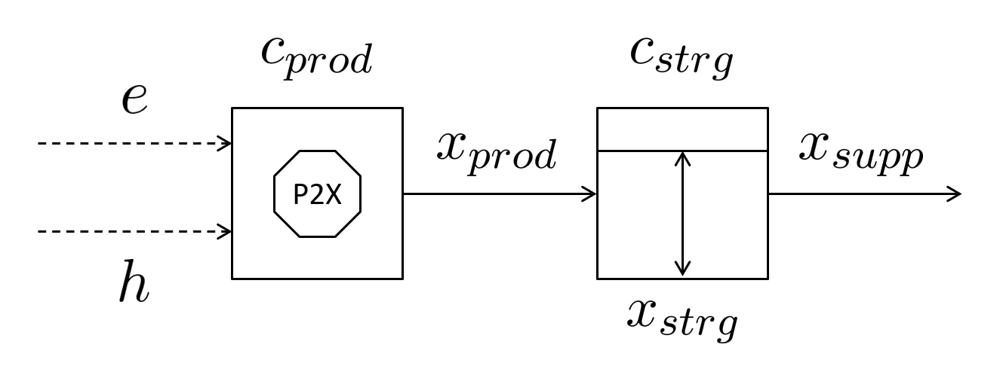
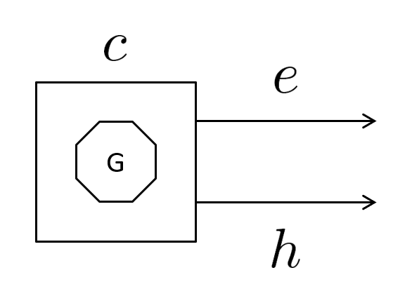
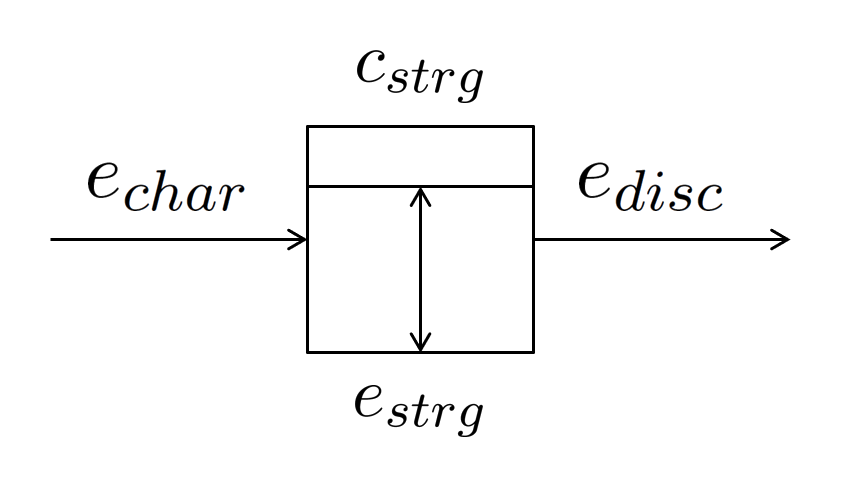

# IES Optimiser IO File Structure

#### Introduction

This article documents the input-output (IO) file structure used by the [Integrated Energy Systems Optimiser](https://github.com/greoux-research/ies-optimiser) (IES Optimiser), a linear optimiser-based energy system modelling environment designed to support initial investigations such as options evaluation and trend analysis.

IES Optimiser's modelling approach is described in [this article](ies-optimiser-modelling-approach.md). Installation and run instructions can be found in [the setup guide](ies-optimiser-setup-guide.md).

IES Optimiser is called with a JSON file (referred to as `input.json`) that describes the dataset, followed by any of the `name=value` run options described in [the setup guide](ies-optimiser-setup-guide.md#running-an-ies-optimiser-simulation). The output is a file named `input.ies-optimiser.json` (one `.name_value` segment is added per option). It mirrors `input.json` and adds the optimisation results in place. The input is validated before anything is built — see [Validation](#validation) below — and `ies-optimiser validate input.json` runs the same validation without solving.

Two input formats are read. A **canonical** input carries `"format_version": 1` and holds inputs only; its JSON Schema is printed by `ies-optimiser schema input` (shipped in the package as `ies_optimiser/data/ies-optimiser-input-1.schema.json`). A **legacy** input has no `format_version` and may carry the empty output placeholders shown in the examples below (`output_ns: []`, `kpis`, `solver`...); they are removed on reading, and nothing else is. The bundled datasets are legacy inputs. [Inputs, Validation and the Python API](ies-optimiser-api.md) describes both formats, the validation layers and the structured diagnostics.

---

#### A note on units and conventions

- Power is MW, energy is MWh; a PtX production capacity is Q per hour and a storage capacity is Q, where Q is m³ of water, kg of hydrogen or MWh of heat.
- Fractions are fractions, not percentages: `capacity_factor`, `round_trip_efficiency`, `soc_ini` and `non-served-power-constraint` all take values in [0, 1].
- Capacity set to `-1` is optimised; any other value pins it.
- Demand balances are **inequalities**: supply must meet demand in each hour and may exceed it. Surplus is possible and is not itself an error. It is reported explicitly, hour by hour, as the residual of each balance (`surplus` on each demand, `heat_surplus` on each thermal process), and the cost and emissions of output that no final demand takes are reported as **unallocated** in the [system object](#system-object), so that allocated and unallocated quantities add up to the system totals.
- **Optima need not be unique.** Where two dispatches cost the same — zero-cost units that can overproduce, equally priced units, storage that can be cycled either way — the solver returns one of them, and a different solver build may return another. Dispatch and surplus can therefore differ between equally optimal results; total cost, and every constraint, cannot. Positive variable costs alone do not guarantee uniqueness, and IES Optimiser adds no tie-breaking costs.

---

#### High-level overview

An IES Optimiser dataset defines primary demands (electricity and X commodities: heat, hydrogen, water) and the supply and flexibility options that meet them. The JSON below shows the top-level structure.

```json
{
    "demand": {
        "e": {"iden": "electricity", ...},
        "x": [
            {"iden": "heat", ...},
            {"iden": "hydrogen", ...},
            {"iden": "water", ...}
        ]
    },
    "p2x": [...],
    "generator": [...],
    "flex": [...],
    "solver": {...}
}
```

The five top-level objects are: `demand` (electricity and X), `p2x` (Power-to-X processes), `generator` (power generators), `flex` (flexibility means), and `solver` (linear solver summary, an output). A canonical input adds `"format_version": 1` and omits `solver` and every other output field.

The philosophy of IES Optimiser is to first define the demand and its hourly profile, and then describe how this demand is met:

- Electricity demand — whether primary (final consumption) or secondary (for battery charging or the operation of PtX processes) — is always met by the "grid", i.e. the mix of available generators.
- Demand for commodity X (heat, hydrogen, water) is met by PtX processes, which consume electricity from the "grid" and, where relevant, heat from cogeneration plants.

---

#### Demand objects

Demand objects represent the final consumption of electricity and other commodities (heat, hydrogen, water). Each demand entry follows a consistent structure.

**Demand for electricity**

```json
{
    "iden": "electricity",
    "profile": "dmnd.csv",
    "total": 50e+6,
    "supply_sources": [],
    "var_cost_ns": 20000,
    "l_ns": [0, 1000e+3],
    "output_ns": [],
    "shadow_prices": {
        "demand_match": [],
        "carbon_cap": -1,
        "reliability_cap": -1
    },
    "kpis": {
        "cost": -1,
        "emis": -1,
        "reli": -1
    }
}
```

**Demand for other commodities (heat, hydrogen, water)**

```json
{
    "iden": "hydrogen",
    "profile": "",
    "total": 35e+6,
    "supply_sources": ["p2x-h2"],
    "var_cost_ns": 1000,
    "l_ns": [0, 1e+9],
    "output_ns": [],
    "shadow_prices": {
        "demand_match": []
    },
    "kpis": {
        "cost": -1,
        "emis": -1,
        "reli": -1
    }
}
```

##### General attributes

- `iden` — identifier (*electricity*, *heat*, *hydrogen*, or *water*)
- `total` — annual demand (MWh, kg, or m³ depending on commodity)
- `profile` — optional CSV with 8760 hourly values. May be provided as (1) a CSV file path, (2) an array of 8760 values, or (3) empty for a flat profile. A relative file path resolves against the directory of the input file (or an explicit `--profile-base`), never the working directory; an absolute path is used as written. The bundled datasets name CSVs kept beside the input, e.g. `"dmnd.csv"`. The same rule applies to every profile field, including `inflow_profile`.
- `supply_sources` — PtX processes supplying the X commodity (a list of `iden` of PtX processes is expected here)
- `var_cost_ns` — penalty for unmet demand (\$/MWh, \$/kg, \$/m³)
- `l_ns` — lower and upper bounds `[low, high]` applied to **each hourly** unmet-demand variable, not to the annual total. Unmet demand can never exceed the demand of the hour, whatever `high` says: the effective bound is `low <= unmet[i] <= min(high, demand[i])`. `[0, 0]` forces full service in every hour. `low` must not exceed the demand of any hour (including hours of zero demand); such an input is refused, naming the hour. There is no annual cap on unmet demand for an X commodity; the optional `non-served-power-constraint` run option caps annual unmet **electricity** only.
- `var_cost_ns` — must be `>= 0`. Zero is valid: it makes unmet demand free, but the hourly bound above still applies. A negative penalty is refused: it would pay the model to leave demand unmet.

##### Outputs

- `output_ns` — hourly unmet demand (always present; empty for an inactive commodity demand)
- `shadow_prices["demand_match"]` — hourly dual of the demand-balance row (\$/unit): the rate at which the objective changes as the right-hand side of that row moves **with every variable bound held fixed**. Defined for electricity and for every active commodity X. It is the marginal cost of demand only where unmet demand is not held at its upper bound by demand itself; see `demand_marginal`.
- `shadow_prices["demand_marginal"]` — hourly **dual-based marginal value** of demand (\$/unit). Unmet demand is bounded by `min(l_ns[1], demand)`, so where it sits at a bound set by demand, demand enters that bound as well as the balance row; `demand_marginal` adds the shortfall variable's reduced cost there, and elsewhere equals `demand_match`. Example: generation at 100 \$/MWh, shortage at 10 \$/MWh, demand entirely shed — `demand_match` is 100, `demand_marginal` is 10, and the objective indeed rises by 10 \$ per extra MWh. **What it is, exactly:** a subgradient of the objective as a function of that hour's demand, with the carbon budget and reliability cap held fixed (both are otherwise multiples of the annual total). It always lies between the left and right derivatives and equals the derivative wherever they agree. At a **breakpoint** — demand exactly zero, exactly at a capacity limit, at a change of marginal unit — it may be any value between them and need not equal either: at zero demand with a 100 \$/MWh unit it can read 0 although the next MWh costs 100; at a 1 MW limit with shortage at 1000 \$/MWh it lies between 100 (the last MWh) and 1000 (the next). Exact one-sided derivatives would need a parametric re-solve for each hour and are not computed.
- `shadow_prices["carbon_cap"]` — marginal value of relaxing the carbon cap by one unit (\$/unit), or `0` when the cap is not binding. Electricity demand only.
- `shadow_prices["carbon_cap_detail"]` — what was observed, kept separate from the interpretation above: `raw_dual`, `cap`, `activity`, `slack`, `binding`, and `binding_zero_dual`. The last records an observation and not a diagnosis: a binding row whose dual is zero may be degenerate, or its marginal value may genuinely be zero and unique — a cap set exactly where the solution would have landed anyway binds and is worth nothing. Telling those apart requires analysis IES Optimiser does not perform.
- `shadow_prices["reliability_cap"]` — marginal value of relaxing the annual unmet-electricity cap by one unit (\$/unit), or `0` when that cap is not binding. Electricity demand only.
- `shadow_prices["reliability_cap_detail"]` — as for the carbon cap.
- `kpis["cost"]` — **compatibility field, retained with its original formula**: `(allocated resource cost + shortage penalty) / annual demand` (\$/unit). Two cautions. It adds the penalty charged on unserved demand to the money actually spent on supply, and it divides by demand rather than by the volume delivered — so it is not a cost per unit delivered. Prefer the `accounts` fields below. For a Power-to-X product the KPI is not a production cost at all: the process's own plant cost is pooled with the rest of the system and spread over every demand by electricity-equivalent use. To cost a product directly — its plant plus its electricity and heat at their hourly marginal value — use `tools/product_costs.py`.
- `kpis["emis"]` — average emissions per unit of annual demand (kg CO₂eq/unit), on the same allocation.
- `kpis["reli"]` — share of annual demand served, `1 - unmet / demand`. An annual energy ratio, not a security-of-supply metric and not a guarantee about any individual hour. It is known whenever demand is positive, independently of the cost allocation: a demand left entirely unmet reports `0`. `kpis["cost"]` and `kpis["emis"]` remain `-1` when there is no output to allocate by; all three are `-1` for a commodity with zero demand (not applicable).
- `surplus` — hourly residual of the demand balance: for electricity, generation plus net storage discharge minus process consumption minus served demand (MWh); for a product, delivery by the named processes minus served demand (Q). Never negative beyond solver tolerance.
- `accounts` — the quantities behind the cost KPI, reported separately:
    - `allocation_share` — this commodity's share of total electricity-equivalent output, the basis on which system cost and emissions are allocated. `null` if the system produced no output, in which case there is nothing to allocate and the fields derived from it are `null` too.
    - `allocated_output` — the electricity-equivalent output allocated to this commodity (MWh): served demand for electricity; for a product, its processes' electricity use plus the heat they used, valued at each supplier's coefficient `a`.
    - `surplus` — annual sum of the `surplus` series, in the commodity's own unit.
    - `resource_cost` — system cost allocated to this commodity (\$). Excludes shortage penalties.
    - `shortage_penalty` — `unmet_demand × var_cost_ns` (\$). A modelled price on a shortfall, not expenditure on supply.
    - `emissions` — emissions allocated to this commodity (kg CO₂eq).
    - `demand`, `unmet_demand`, `served_demand` — annual volumes.
    - `resource_cost_per_demand`, `resource_cost_per_served` — resource cost per unit demanded and per unit actually delivered (\$/unit). The second is `null` when nothing was delivered.

The allocation of joint system cost in proportion to electricity-equivalent consumption is a **convention**, not a measurement. In a system where a PtX process is a large share of load it determines how cost divides between commodities, and it should be stated wherever these figures are reported.

How surplus enters the convention, in full:

| Quantity | Where it goes |
|---|---|
| Electricity served to final demand | electricity share |
| A process's electricity use and the heat it used (× `a`) | that process's product share |
| Product produced but not delivered (product surplus) | stays in that product's share — its energy is an input to that chain, and is counted once |
| Electricity surplus | unallocated |
| Heat generated but not used by the process (× `a` of each supplier, pro rata to its heat that hour) | unallocated |
| Use by a process that no active demand names | unallocated |
| Reservoir spill | not output at all; reported in `system.surplus.spill` |
| Storage losses (charge exceeding discharge) | reduce total output, so borne by every share |

Shortage penalties are never part of resource cost, allocated or not.

---

#### Validation

The input is checked before the problem is built. A failure names the entity, the field and the reason, and, on the command line, exits with status 1 without writing a result. Each refusal carries a stable code and a JSON Pointer path ([Diagnostics](ies-optimiser-api.md#diagnostics)). The checks are made in layers, each rule by one owner: **structure** by the input models (`ies_optimiser.models`, which also generate the JSON Schema), then **semantics** and **profiles** by `ies_optimiser.chk`, then **thermodynamics**.

| Field | Accepted | Layer |
|---|---|---|
| every number | a JSON number, finite (no NaN, no infinity, no string or boolean) | structure |
| unknown fields | refused (a legacy input's documented output placeholders are removed first) | structure |
| `type` | `elec` or `elec + ther` | structure |
| `c_prod`, `c_strg` | `-1` (optimise) or a non-negative number; other negative values are refused | structure |
| `l_prod`, `l_strg`, `l_ns` | two numbers `[low, high]` with `0 <= low <= high`; an inactive commodity demand may give `[]` or omit `l_ns` | structure |
| `l_ns[0]` | no greater than the demand of any hour | semantics |
| `capacity_factor` | `0 <= cf <= 1` | structure |
| `round_trip_efficiency` | `0 < r <= 1` | structure |
| `hours_of_storage` | `> 0` | structure |
| `soc_min`, `soc_ini`, `soc_max` | `0 <= soc_min <= soc_ini <= soc_max <= 1`; a process's `soc_ini` in `[0, 1]` | structure |
| `total`, `inflow_total` | `>= 0` | structure |
| `pow_use_elec_prod`, `pow_use_ther_prod` | `>= 0`; a heat use on an `elec` process is refused (it would be ignored) | structure |
| `temperature` | required for an `elec + ther` process | structure |
| `var_cost_ns` | `>= 0`; required, with `l_ns`, for an active demand | structure |
| `charge_allowed` | `true` or `false` | structure |
| profiles | a CSV path, a list of numbers or `''`; the file exists where the rule places it; finite, non-negative, not all zero, 8760 values | structure (form), profiles (content) |
| identifiers | unique within generators, flexibility means and processes; unique across demands | semantics |
| topology | a demand names existing processes; a process supplies at most one active demand; the thermal rules under [Generators](#generators) | semantics |
| cogeneration | admissible coefficients for every generator that supplies heat | thermodynamics |
| output fields | absent from a canonical input. In a legacy input the documented placeholders must be empty; one that already holds values is refused (`input.is_result`): the document is a result, and its optimised capacities would be read as fixed ones | format |
| optional fields | may be omitted, and then take these values, which are written into the model's copy of the input and appear in the result: `profile` `''` (flat), `supply_sources` `[]`, `turbine_t_p` `[]`, `condenser_p` `0`, `soc_min` `0`, `soc_max` `1`, `inflow_total` `0`, `charge_allowed` `true`, a process's `temperature` `0` (electric processes only). `inflow_profile` may be omitted (flat). `a` and `b` are outputs and are always set by IES Optimiser. An explicit `null` is not an omission and is refused | structure |

What is deliberately **accepted**: negative emission factors (removal technologies), negative carbon targets, zero variable costs, zero shortage penalties and, as a domain choice, negative economic costs (a subsidy or a revenue) — the capacity bounds keep such a problem bounded. A case that passes every check may still be **infeasible**; that is reported as a solver status, not as an input error.

---

#### Power-to-X (PtX) processes &nbsp;|&nbsp; [Modelling approach →](ies-optimiser-modelling-approach.md#ptx-processes)

PtX processes convert electricity, and sometimes heat, into products such as hydrogen, water, or heat. Each process combines general attributes, a production unit, and a storage unit.

<div align="center">

</div>

**Electricity-consuming process (e.g., RO)**

```json
{
    "iden": "p2x-ro",
    "profile": "",
    "capacity_factor": 0.850,
    "type": "elec",
    "temperature": 0,
    "supply_sources": [],
    "fix_cost_strg": 0.22,
    "l_strg": [0, 2190e+6],
    "c_strg": -1,
    "x_strg": [],
    "fix_cost_prod": 2070,
    "var_cost_prod": 0.35,
    "pow_use_elec_prod": 4.5e-3,
    "pow_use_ther_prod": 0,
    "l_prod": [0, 1e+6],
    "c_prod": -1,
    "x_prod": [],
    "soc_ini": 1.0,
    "x_supp": [],
    "shadow_prices": {
        "demand_match": []
    }
}
```

**Electricity- and heat-consuming process (e.g., MED)**

```json
{
    "iden": "p2x-med",
    "profile": "",
    "capacity_factor": 0.850,
    "type": "elec + ther",
    "temperature": 80,
    "supply_sources": ["nucl", "coal", "ccgt"],
    "fix_cost_strg": 0.22,
    "l_strg": [0, 2190e+6],
    "c_strg": -1,
    "x_strg": [],
    "fix_cost_prod": 2185,
    "var_cost_prod": 0.26,
    "pow_use_elec_prod": 1.5e-3,
    "pow_use_ther_prod": 50e-3,
    "l_prod": [0, 1e+6],
    "c_prod": -1,
    "x_prod": [],
    "soc_ini": 1.0,
    "x_supp": [],
    "shadow_prices": {
        "demand_match": []
    }
}
```

##### General attributes

- `type` — *elec* (electric only) or *elec + ther* (electricity plus heat)
- `temperature` — required steam extraction temperature (°C, thermal processes only)
- `capacity_factor` — as for generators: a fraction, the target annual mean of the rescaled profile, and a flat hourly ceiling when no profile is given.
- `profile` — optional hourly shape with 8760 values, as (1) a CSV file path, (2) a list or array of 8760 values, or (3) empty for a flat profile. **A profile supplies shape only.** It is divided by its own maximum and then rescaled so that its mean equals `capacity_factor`, so the level is set by `capacity_factor` and the profile's own average is discarded. One consequence matters: where `capacity_factor` exceeds the profile's own mean/max ratio, the rescaled series passes one, and output is then held to the installed capacity by an explicit nameplate limit rather than by the availability relation. Values must be finite, non-negative, and not all zero.
- `supply_sources` — thermal generators supplying heat in cogeneration mode (a list of generator `iden`). A process may draw on several generators. A generator may supply **only one** process: each process carries its own heat balance against the same heat variables, so two processes sharing a generator would each be satisfied by the same heat. Such a configuration is rejected before the problem is built, as is a shared generator serving processes at different extraction temperatures.

##### Production unit

- `c_prod` — production capacity (Q/hour). Will be optimised by the solver if set to -1
- `l_prod` — lower and upper bounds on the **installed production capacity** `c_prod` (Q/hour). They bound neither the hourly production rate nor the hourly delivery rate; delivery draws on the store and may exceed the production rate.
- `fix_cost_prod` — fixed production costs (\$ per (Q/hour) per year)
- `var_cost_prod` — variable costs excluding energy (\$/Q)
- `pow_use_elec_prod` — electricity use (MWh/Q)
- `pow_use_ther_prod` — heat use (MWh/Q)

##### Storage unit

- `c_strg` — storage capacity (Q). Will be optimised by the solver if set to -1
- `l_strg` — lower and upper bounds on the **installed storage capacity** `c_strg` (Q), not on the hourly inventory.
- `fix_cost_strg` — fixed storage costs (\$ per Q per year)
- `soc_ini` — the inventory at the start of the year, as a fraction of `c_strg`. The year is closed on the same level: the store ends where it began, so nothing is created or consumed by the boundary. Seasonal accumulation within the year is permitted.

##### Outputs

- `x_prod` — hourly production (Q/hour)
- `x_strg` — storage level (Q)
- `x_supp` — hourly supply (Q/hour)
- `heat_surplus` — hourly heat supplied beyond the process's requirement (MWh of heat); empty for a purely electric process.
- `availability` — as for generators: `capacity_factor_requested`, `profile_peak`, `hours_above_nameplate`, `capacity_factor_effective`.
- `shadow_prices["demand_match"]` — hourly shadow heat supply prices (\$/MWh of heat), the dual of this process's heat balance. Applies to thermally coupled processes only; a purely electric process (reverse osmosis, electrolysis) has no heat constraint and the series is empty. This is the price of *heat into the process*, and is distinct from the delivery price of the product itself, which is `shadow_prices["demand_match"]` on the corresponding demand object.

---

#### Generators &nbsp;|&nbsp; [Modelling approach →](ies-optimiser-modelling-approach.md#generators)

Generators represent technologies that produce electricity, heat, or both. Dispatchable units (nuclear, coal, CCGT) may use only a capacity factor, while variable renewables (solar, wind) require hourly profiles.

<div align="center">

</div>

**Electricity-generating plant — variable (e.g., wind)**

```json
{
    "iden": "wind",
    "profile": "wind.csv",
    "capacity_factor": 0.250,
    "type": "elec",
    "fix_cost_prod": 133553,
    "var_cost_prod": 6e-6,
    "var_emis_prod": 0,
    "l_prod": [0, 100e+3],
    "c_prod": -1,
    "e_prod": [],
    "h_prod": [],
    "turbine_t_p": [],
    "condenser_p": 0,
    "a": 0,
    "b": 0
}
```

**Electricity-generating plant — fully dispatchable (e.g., OCGT)**

```json
{
    "iden": "ocgt",
    "profile": "",
    "capacity_factor": 0.850,
    "type": "elec",
    "fix_cost_prod": 75182,
    "var_cost_prod": 96.11,
    "var_emis_prod": 523,
    "l_prod": [0, 100e+3],
    "c_prod": -1,
    "e_prod": [],
    "h_prod": [],
    "turbine_t_p": [],
    "condenser_p": 0,
    "a": 0,
    "b": 0
}
```

**Cogeneration plant (e.g., CCGT)**

```json
{
    "iden": "ccgt",
    "profile": "",
    "capacity_factor": 0.850,
    "type": "elec + ther",
    "fix_cost_prod": 98749,
    "var_cost_prod": 56.44,
    "var_emis_prod": 365,
    "l_prod": [0, 100e+3],
    "c_prod": -1,
    "e_prod": [],
    "h_prod": [],
    "turbine_t_p": [564, 152],
    "condenser_p": 0.05,
    "a": 0,
    "b": 0
}
```

##### General attributes

- `type` — *elec* or *elec + ther* (thermal generators eligible to supply heat in cogeneration mode)
- `profile` — empty for dispatchable units, required for renewables. Hourly shape with 8760 values, as (1) a CSV file path, (2) a list or array of 8760 values, or (3) empty for a flat profile. **A profile supplies shape only.** It is divided by its own maximum and then rescaled so that its mean equals `capacity_factor`, so the level is set by `capacity_factor` and the profile's own average is discarded. One consequence matters: where `capacity_factor` exceeds the profile's own mean/max ratio, the rescaled series passes one, and output is then held to the installed capacity by an explicit nameplate limit rather than by the availability relation. Values must be finite, non-negative, and not all zero.
- `capacity_factor` — a **fraction**, not a percentage. With a profile it is the target annual mean of the rescaled series; without one it is a flat ceiling applied in every hour. It is not an annual energy budget and does not represent scheduled maintenance: a unit may run at that fraction of nameplate in all 8760 hours. To represent an outage, give a profile that is zero in the affected hours and set `capacity_factor` to the resulting availability, so the series peaks at one.
- `l_prod` — lower and upper bounds on the **installed capacity** `c_prod` (MW). They do not bound hourly output: a positive lower bound requires the capacity to be built, not to be run.
- `c_prod` — installed capacity (MW). Will be optimised by the solver if set to -1

##### Costs and emissions

- `fix_cost_prod` — fixed costs (\$/MW/year)
- `var_cost_prod` — variable costs (\$/MWh)
- `var_emis_prod` — emissions (kg CO₂eq/MWh)

##### Cogeneration parameters

- `turbine_t_p` — turbine inlet temperature (°C) and pressure (bar)
- `condenser_p` — condenser pressure (bar)
- `a`, `b` — coefficients describing the electricity–heat trade-off (calculated by IES Optimiser)

The coefficients are computed by `thermo/sim.bin` only for a unit that supplies a thermally coupled process. The supported domain is checked, not assumed: the inlet steam must be superheated, `0 < condenser_p < turbine inlet pressure`, and the process's extraction `temperature` must lie **strictly** between the saturation temperatures at the condenser and inlet pressures (for 290 °C / 70 bar and 0.05 bar, between about 32.88 °C and 285.83 °C). Outside that range the extraction pressure would not lie between the two, and no such plant exists. The result must also be admissible: `0 < a < 1`, `b > 0`, `a × b < 1`. A failure stops the run and names the generator, the process and the reason; a coupled unit is never silently turned into an electric-only one. (An `elec + ther` unit that no process draws heat from is reported as `elec`, since it produces no heat.) The executable prints the coefficients to six significant figures, and that is the precision the model uses.

##### Outputs

- `e_prod` — hourly electricity production (MWh)
- `availability` — what the profile asked for against what it delivered, so the effect of the nameplate limit is visible rather than absorbed into the result: `capacity_factor_requested`, `profile_peak` (the maximum of the rescaled series), `hours_above_nameplate`, and `capacity_factor_effective` (the mean availability remaining once output is held to the installed capacity). Where the peak is at or below one, the requested and effective figures agree.
- `h_prod` — hourly heat production (MWh)

---

#### Flexibility means &nbsp;|&nbsp; [Modelling approach →](ies-optimiser-modelling-approach.md#flexibility-means)

Flexibility means represent energy storage systems such as batteries or pumped hydro. They allow electricity to be shifted in time with round-trip efficiency losses.

<div align="center">

</div>

```json
{
    "iden": "bstr",
    "fix_cost_strg": 27248,
    "hours_of_storage": 4,
    "round_trip_efficiency": 0.85,
    "l_strg": [0, 400e+3],
    "c_strg": -1,
    "e_strg": [],
    "soc_ini": 0.5,
    "soc_min": 0,
    "soc_max": 1,
    "e_char": [],
    "e_disc": []
}
```

##### General attributes

- `fix_cost_strg` — annual fixed costs (\$/MWh/year)
- `hours_of_storage` — storage duration at maximum discharge (hours). Charge and discharge power are limited to `c_strg / hours_of_storage`, which is what relates the power rating (MW) to the energy rating (MWh).
- `round_trip_efficiency` — round-trip efficiency (in [0, 1])
- `soc_ini` — initial state of charge (fraction of `c_strg`)
- `soc_min` — minimum state of charge (fraction of `c_strg`, default 0). Use it to represent dead storage, minimum operating levels, or a regulatory reserve such as the Swiss *Wasserkraftreserve*
- `soc_max` — maximum state of charge (fraction of `c_strg`, default 1). Use it to hold back head room, for instance for flood control
- `l_strg` — lower and upper bounds on the **installed energy capacity** `c_strg` (MWh). They bound neither the hourly inventory, which follows the state-of-charge limits, nor the charge and discharge powers (MW), which follow the duration limit above.
- `c_strg` — storage capacity (MWh). Will be optimised by the solver if set to -1

##### Natural inflow (optional)

Reservoir hydro is represented by a flexibility means that is replenished by an exogenous
inflow — rainfall, snowmelt, glacier melt — rather than by charging from the grid.

- `inflow_total` — annual inflow energy (MWh). Absent or 0 means no inflow, and the object behaves as a conventional storage device
- `inflow_profile` — hourly shape of the inflow. May be provided as (1) a CSV file path, (2) an array of 8760 values, or (3) empty for a flat profile. Scaled so that its sum equals `inflow_total`
- `charge_allowed` — set to `false` to forbid charging from the grid (default `true`). A dam fed only by its catchment should set this to `false`, so that it cannot act as free pumped storage

`soc_ini` must lie between `soc_min` and `soc_max`, and the storage level is held within
those bounds at every hour:

$$
\text{soc}_\text{min} \times c_\text{strg} \le e_\text{strg}(i) \le \text{soc}_\text{max} \times c_\text{strg}
$$

Leaving both at their defaults reproduces Equation 11 exactly.

With inflow present, the storage balance of Equation 13 gains two terms:

$$
e_\text{strg}(i) = e_\text{strg}(i-1) + e_\text{infl}(i) - e_\text{spil}(i) + \sqrt{r_\text{strg}} \times e_\text{char}(i) - e_\text{disc}(i) / \sqrt{r_\text{strg}}
$$

Inflow is not subject to the round-trip penalty, since water arriving in a reservoir has not
been pumped there. The spill variable $e_\text{spil}$ is free and allows water to be released
without generating; without it, inflow arriving at a full reservoir would make the problem
infeasible rather than spill, as a real dam does.

##### Outputs

- `e_strg` — energy stored (MWh)
- `e_char` — charging power (MW)
- `e_disc` — discharging power (MW)
- `e_spil` — spilled inflow (MWh). Present only when `inflow_total` > 0

---

#### System object

Totals for the run as a whole, reported directly rather than through the
commodity allocation.

##### Outputs

- `cost` — total system cost (\$): fixed capacity charges plus variable costs, for every generator, flexibility means and PtX process. Excludes shortage penalties.
- `output` — total electricity-equivalent output (MWh), the denominator of every allocation share.
- `emis` — total emissions (kg CO₂eq).
- `allocation_defined` — `false` when total output is zero, so there is nothing to allocate by.
- `allocated_share_total` — sum of the commodity allocation shares; `null` when allocation is undefined. It equals 1 only when nothing is unallocated; with surplus it is below 1, and `allocated_share_total + unallocated.share = 1`.
- `allocated` — `output`, `share`, `cost`, `emis` allocated to final demands. When allocation is undefined the share is `null` and cost and emissions are 0: nothing was allocated.
- `unallocated` — the same four quantities for output that no final demand takes, with its components `electricity_surplus`, `unused_heat` (electricity-equivalent) and `unassigned_process_use`. When allocation is undefined, the whole system cost and emissions are reported here.
- `surplus` — annual totals: `electricity` (MWh), `heat` (MWh of heat), `spill` (MWh), `products` (per demand, in its unit), `unassigned_product_supply` (per process no active demand names).
- `checks` — machine-readable accounting checks, each `{residual, tolerance, ok}`: `electricity_balance`, `heat_balance`, `product_balance`, `shortfall_bounds`, `storage_balance` (transitions and closure, electricity and product stores), `carbon_cap`, `reliability_cap`, `output_reconciliation`, `cost_reconciliation`, `emissions_reconciliation`, `allocated_cost_reconciliation`, `objective_reconciliation` (`system cost + shortage penalties = solver objective + fixed-capacity charges`). Only the checks that apply to the run are present. Feasibility checks use `1e-5 + 1e-7 × scale`, reconciliation identities `1e-6 + 1e-9 × scale` (`fcn.Feas_*`, `fcn.Recon_*`).
- `accounting_ok` — `true` when every check passed. IES Optimiser exits with status **3** when an optimal solve fails any of them.

The totals reconcile by construction of the accounts:

```
allocated.output + unallocated.output = output
allocated.cost   + unallocated.cost   = cost
allocated.emis   + unallocated.emis   = emis
```

#### Provenance object

Written into every result, identifying what produced it.

##### Outputs

- `ies_optimiser_version` — the version of the package that solved the problem, from its distribution metadata (`pyproject.toml` in a source tree that is not installed), or `unknown`.
- `installation` — `{kind, package_dir}`: `wheel` (an installed distribution), `editable` (an editable install of a checkout), `source` (a checkout on the path, not installed) or `unknown`, and the directory of the package that ran.
- `result_format_version` — the result format (1), described by the result schema (`ies-optimiser schema result`).
- `input_format` — `canonical` or `legacy`: the format the input was read in.
- `input`, `input_sha256` — the input file named as the source and its SHA-256 digest (for a case supplied in memory without a source, `<in-memory>` and the digest of the document as given).
- `case_sha256` — the SHA-256 of the case actually solved, as canonical JSON (inputs only, defaults explicit, keys sorted): the same for a legacy document and its canonical form. A case edited in memory and solved with its original file as the source has the file's `input_sha256` but its own `case_sha256`.
- `source_matches_case` — whether the source file, read the same way, is the case solved (`false` for such an edited case); `null` without a source file.
- `input_resolved` — the absolute path of the input file read; `null` for a case supplied in memory.
- `profiles_sha256` — each declared profile reference, as written in the input, with the digest of the file actually read for it. Profiles are named by path rather than carried in the input, and they determine the answer as directly as anything inside it.
- `profile_files` — for each declared reference, the file actually read (`resolved`, absolute) and its `sha256`.
- `profile_resolution` — how relative profile paths were resolved: `mode` is `input-directory` (the input file's directory, the default), `explicit` (a `--profile-base` or `RunConfig.profile_base`), or `none` (an in-memory case with no base, which accepts only inline, empty or absolute profiles); `base` is the absolute directory used, or `null`. Moving a case changes `input_resolved`, `profile_files[*].resolved` and `base`, never the digests.
- `options` — the `name=value` options applied to the run.
- `hours`, `storage_closes_the_year` — the horizon, and whether storage is required to end the year where it began.
- `git_scope` — Git is consulted only when IES Optimiser runs from a source checkout (editable or source): `ies_optimiser` when the checkout is the top of its own repository; `enclosing` when the nearest repository is another project that contains it (vendored); `null` otherwise, and always `null` for an installed wheel, whose revision the repository around a virtual environment does not describe.
- `git_revision`, `git_dirty` — the commit IES Optimiser's own checkout is on, and whether it still matches it. Both are `null` unless `git_scope` is `ies_optimiser`: an enclosing repository's commit does not identify IES Optimiser.
- `enclosing_git` — `{toplevel, revision, dirty}` of the enclosing repository when `git_scope` is `enclosing`, otherwise `null`.
- `thermo_binary` — the absolute path of the thermodynamics executable that ran: the one installed with the package (`ies_optimiser/_bin/ies-optimiser-thermo`), resolved through the package, never the working directory, unless `RunConfig.thermo_bin` overrides it. Its digest appears under the key `thermo/sim.bin`.
- `thermo_binary_origin` — `packaged` or `override`.
- `source_sha256`, `source_files_sha256` — a digest over every module of the running package (keyed `ies_optimiser/<module>.py`) and the thermodynamics executable (keyed `thermo/sim.bin`), with the per-file digests beside it. The version string is a label that two different trees can share; this identifies the code that actually ran, including the untracked binary that sets the cogeneration coefficients.
- `solver`, `ortools` — the solver and its version. This matters: a different build may settle on a different vertex of the same optimal face, so two runs agreeing on cost can differ hour by hour.
- `numpy`, `python`, `platform`, `run_utc` — the rest of the environment, and when the run happened.

---

#### Solver object &nbsp;|&nbsp; [Modelling approach →](ies-optimiser-modelling-approach.md#linear-optimisation-problem)

The solver object provides diagnostics for each optimisation run: status, run time, and problem size.

##### Outputs

- `stat_succ` — 1 if the solve reached an optimal solution, 0 if it did not, -1 before the run. **IES Optimiser also exits non-zero when the solve was unsuccessful**, so a calling script need not read the result to find out. Exit status: `0` optimal and accounts reconcile; `1` refused input or options (nothing is written), or no optimal solution (the file is written); `3` optimal but `system.accounting_ok` is false.
- `stat_status` — why, in words: `optimal`, `infeasible`, `unbounded`, `abnormal (numerical trouble)`, `not solved`. **A run that does not reach an optimal solution still writes an output file**, holding the case's input fields (defaults written in, no output placeholders), the solver status and provenance — and no result fields, so nothing unavailable can be read as a number. Check this field before reading anything else.
- `stat_time` — elapsed time (seconds)
- `stat_capa` — number of capacity variables
- `stat_outp` — number of output variables
- `stat_cons` — total number of constraints

> **Note.** The objective minimised by the solver omits fixed capacity charges for
> assets whose capacity is *fixed* by the input (`c_prod` or `c_strg` set rather
> than `-1`), because a constant cannot change the optimum. `cost` above includes
> them. When comparing the two, reconcile with
> `system cost + shortage penalties = solver objective + fixed-capacity charges`.
