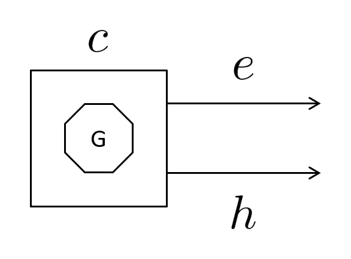
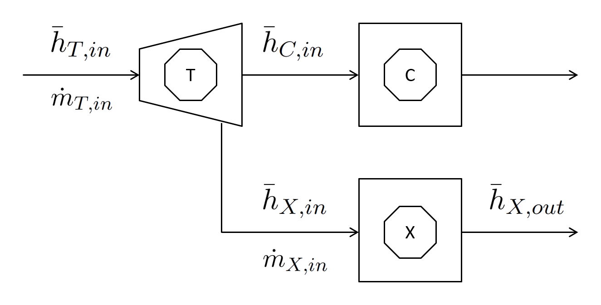
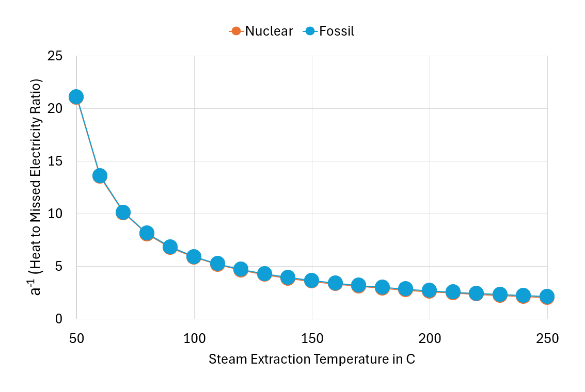
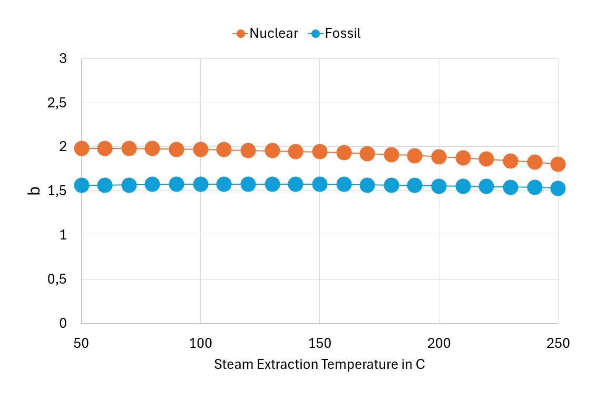
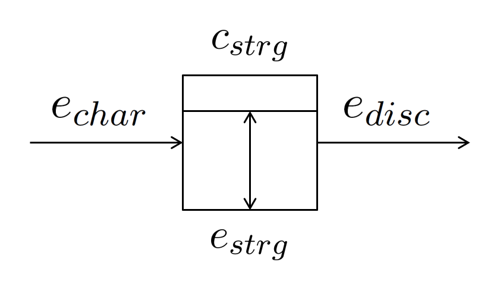
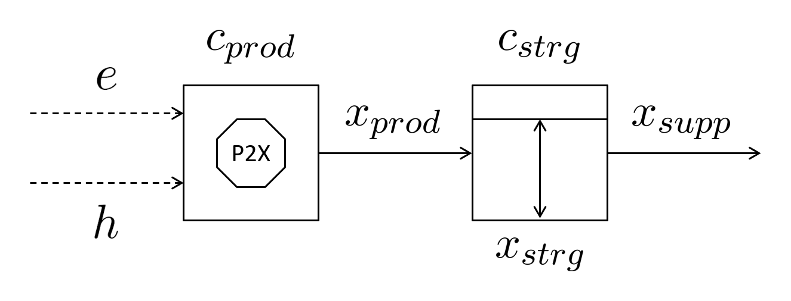

# IESO Modelling Approach

#### Introduction

The [Integrated Energy Systems Optimiser (IESO)](https://github.com/greoux-research/ieso) is a linear optimiser-based energy system modelling environment designed to support initial investigations such as options evaluation and trend analysis.

You can find installation and run instructions in [the setup guide](ieso-setup-guide.md), while the structure of the input-output (IO) data, organised in JSON format, [is described here](ieso-io-file-structure.md).

IESO allows users to explore questions such as:

- What would be the optimal energy mix for a given country, considering a typical demand curve, renewable energy output profiles, and emission constraints?
- What would the cost of electricity generation be for the same country, and what factors influence this cost?
- What would be the impact of adding or removing specific technologies?
- What is the potential value of Power-to-X technologies, and how would they affect the cost of hydrogen and desalinated water produced through electrolysis and reverse osmosis?

The reliance on a linear optimiser allows for quick simulations and provides preliminary answers to these questions. In comparison, conventional modelling tools often rely on mixed-integer linear programming (MILP) techniques and require powerful commercial solvers. This makes the optimisation process computationally demanding and limits its accessibility to experienced energy modellers and planners with access to such resources.

IESO brings together generators, flexibility options, and Power-to-X (PtX) processes to meet final demands for electricity, process heat, hydrogen, water, and potentially other by-products. It operates under a "green field" configuration and assumes perfect foresight of energy demands and resource availability.

The model relies on a simplified linear structure and is solved using the open-source [Google Linear Optimisation Package](https://developers.google.com/optimization/lp) (GLOP). It incorporates key inputs such as annual demand, demand profiles, and the technical and economic characteristics of energy system components, including fixed and variable costs, emissions, and output profiles. At the same time, it deliberately abstracts from detailed representations of individual power plants, transmission and distribution networks, and operational constraints such as ramping limits or reserve requirements.

In practice, the model assumes that all technologies are infinitely flexible, constrained only by their installed capacity and capacity factors. Within this framework, IESO identifies the optimal investment mix of assets required to achieve three main objectives:

- Minimising generation costs
- Meeting emissions reduction targets
- Securing a continuous supply of electricity and other by-products (heat, hydrogen, water, etc.)

The following sections present IESO's core building blocks (generators, flexibility means, and PtX processes) and outline the formulation of the linear optimisation problem.

---

#### Generators

IESO allows the definition of different generator profiles, ranging from fully dispatchable units, such as nuclear and coal, to variable renewable sources like solar and wind, as well as cogeneration systems producing both electricity and heat, such as combined cycle gas turbines (CCGT).

In IESO, a generic power generation technology (Figure 1) is described by the variables listed in Table 1.

<em>Figure 1: IESO Representation of a Generator</em>

| Symbol | Description | Unit |
|--------|-------------|------|
| $e$ | Electricity output | MW |
| $h$ | Heat output (thermal power plants only) | MW |
| $c$ | Capacity | MW |
| $f$ | Capacity factor | % |
| $k_\text{fix}$ | Fixed costs | \$ per MW per Year |
| $k_\text{var}$ | Variable costs | \$ per MWh |
| $s_\text{var}$ | Variable emissions | kg CO₂eq per MWh |

*Table 1: Generators' Variables*

Generators are mainly characterised by the amount of power they produce ($e$), which is limited by their installed capacity ($c$) and capacity factor ($f$) (Equation 1). Other inputs used in the optimisation process include their fixed costs (capital and O&M) ($k_\text{fix}$), variable costs (mostly fuel) ($k_\text{var}$), and emissions ($s_\text{var}$).

$$
0 \leq e \leq f \times c \tag{1}
$$

The output of renewable energy sources is time- and weather-dependent. As a result, the associated capacity factor is relatively low, typically comprised between 15% (for solar photovoltaic) and 45% (for offshore wind). In order to accurately model the intermittent nature of these sources, IESO requires an hourly output profile (in the form of a CSV file) to be specified.

Conversely, power sources that can be dispatched, such as coal power plants, combined cycle gas turbines (CCGTs), and nuclear power reactors, are usually available between 80% and 90% of the time. Furthermore, these technologies can operate in cogeneration mode and produce heat ($h$), in addition to electricity ($e$), which can lead to better asset utilisation efficiency.

When operating in cogeneration mode, a thermal power plant generates heat, typically through steam extraction from the steam turbine's low-pressure section. IESO relies on a simplified representation of power conversion thermodynamics, illustrated in Figure 2, to capture the interrelationships between electricity and heat generation and their respective (variable) costs.

<em>Figure 2: IESO Representation of Power Conversion Thermodynamics</em>

In this representation, $\bar{h}_{T,in}$ denotes the specific enthalpy at the turbine's (T) inlet, $\bar{h}_{X,in}$ and $\bar{h}_{X,out}$ are the specific enthalpies at the inlet and outlet of the heat exchanger (X), and $\bar{h}_{C,in}$ is the specific enthalpy at the condenser's (C) inlet. The steam extracted from the turbine fully condenses in the heat exchanger (X), giving up its latent heat to the external process.

The electric power generated by the turbine (T) can be expressed as:

$$
e = \dot{m}_{T,in} \left(\bar{h}_{T,in} - \bar{h}_{C,in}\right) - \dot{m}_{X,in} \left(\bar{h}_{X,in} - \bar{h}_{C,in}\right) \tag{2}
$$

$\dot{m}$ refers to the mass flow rate, and $\bar{h}$ refers to the specific enthalpy at different points of the circuit.

The first term on the right-hand side of Equation 2, $\dot{m}_{T,in} \left(\bar{h}_{T,in} - \bar{h}_{C,in}\right)$, represents the electricity output of the plant in the absence of steam extraction ($e_\text{max}$). The second term, $\dot{m}_{X,in} \left(\bar{h}_{X,in} - \bar{h}_{C,in}\right)$, is directly proportional to the flow rate of steam ($\dot{m}_{X,in}$) being extracted and quantifies the electricity generation that is forgone due to supplying heat ($h$) to the external process.

The heat transferred to the external process via the exchanger (X) is given by:

$$
h = \dot{m}_{X,in} \left(\bar{h}_{X,in} - \bar{h}_{X,out}\right) \tag{3}
$$

$h$ has an upper limit ($h_\text{max}$) that it cannot surpass. This limit, reached when $\dot{m}_{X,in} = \dot{m}_{T,in}$, is a function of $e_\text{max}$:

$$
h_\text{max} = e_\text{max} \times \frac{\bar{h}_{X,in} - \bar{h}_{X,out}}{\bar{h}_{T,in} - \bar{h}_{C,in}} \tag{4}
$$

By expressing the missed electricity production in terms of $h$, Equation 2 can be reformulated as follows:

$$
e = e_\text{max} - h \times \frac{\bar{h}_{X,in} - \bar{h}_{C,in}}{\bar{h}_{X,in} - \bar{h}_{X,out}} \tag{5}
$$

The simplified thermodynamic model described above suggests that when the thermal plant operates in cogeneration mode, the hourly flows of electricity and heat that can be produced are subject to the following constraints:

$$
0 \leq e \leq f \times c - a \times h \tag{6}
$$

$$
0 \leq h \leq b \times f \times c \tag{7}
$$

The coefficients $a$ and $b$ are directly related to two key characteristics of the power conversion system: the turbine's inlet and outlet conditions. They also depend on the steam's latent heat at the extraction point:

$$
a = \frac{\bar{h}_{X,in} - \bar{h}_{C,in}}{\bar{h}_{X,in} - \bar{h}_{X,out}} \tag{8}
$$

$$
b = \frac{\bar{h}_{X,in} - \bar{h}_{X,out}}{\bar{h}_{T,in} - \bar{h}_{C,in}} \tag{9}
$$

By establishing a relationship between the missed power generation and the thermal energy supplied to the external process, $a$ also provides a basis for estimating the variable costs associated with heat production ($k_{\text{var},h}$):

$$
k_{\text{var},h} = a \times k_\text{var} \tag{10}
$$

Figures 3 and 4 illustrate the variation of coefficients $a^{-1}$ and $b$ with steam extraction temperature for two power generation technologies: nuclear and fossil fuel-based power plants.

<em>Figure 3: Coefficient a⁻¹ vs Steam Extraction Temperature</em>

<em>Figure 4: Coefficient b vs Steam Extraction Temperature</em>

> Figures 3 and 4 assume the following: (1) Condenser pressure: 0.05 bar for both technologies; (2) Steam condition at turbine inlet: 290°C | 70 bar (nuclear power plant) and 564°C | 152 bar (fossil fuel-based power plant); (3) The state of steam at the outlet of the turbine is determined applying an isentropic efficiency of 88%.

---

#### Flexibility means

The IESO 'flexibility means' object (Figure 5) is used to represent electricity storage devices, such as battery energy storage systems (BESS) and pumped-storage hydroelectricity.

<em>Figure 5: IESO Representation of Flexibility Means</em>

The key characteristics of the object are described in the table below.

| Symbol | Description | Unit |
|--------|-------------|------|
| $e_\text{char}$ | Charge rate | MW |
| $e_\text{disc}$ | Discharge rate | MW |
| $e_\text{strg}$ | MWh of electricity being stored at a given hour | MWh |
| $c_\text{strg}$ | Storage capacity | MWh |
| $n_\text{strg}$ | Hours of storage at maximum discharge | Hour |
| $r_\text{strg}$ | Round-trip efficiency | % |
| $k_\text{fix}$ | Fixed storage costs | \$ per MWh per Year |

*Table 2: Flexibility Means' Variables*

The defining characteristic of an energy storage system is its storage capacity ($c_\text{strg}$), which sets the maximum amount of energy it can hold ($e_\text{strg}$):

$$
0 \leq e_\text{strg} \leq c_\text{strg} \tag{11}
$$

The storage capacity also dictates the limits on how much energy can be charged ($e_\text{char}$) or discharged ($e_\text{disc}$) at any given time:

$$
0 \leq e_\text{char},\, e_\text{disc} \leq \frac{c_\text{strg}}{n_\text{strg}} \tag{12}
$$

The amount of energy being stored ($e_\text{strg}$) fluctuates over time, depending on the rates of energy entering ($e_\text{char}$) and exiting ($e_\text{disc}$) the 'storage tank':

$$
e_\text{strg}(i) = e_\text{strg}(i-1) + \sqrt{r_\text{strg}} \times e_\text{char}(i) - \frac{e_\text{disc}(i)}{\sqrt{r_\text{strg}}} \tag{13}
$$

$i$ denotes the hour of the year, and $i-1$ represents the hour that immediately precedes hour $i$.

The 'storage tank' is considered to be half-full\* at the start of the year, which translates into the following two constraints:

$$
e_\text{strg}(1) = \frac{c_\text{strg}}{2} + \sqrt{r_\text{strg}} \times e_\text{char}(1) - \frac{e_\text{disc}(1)}{\sqrt{r_\text{strg}}} \tag{14}
$$

$$
e_\text{strg}(8760) = \frac{c_\text{strg}}{2} \tag{15}
$$

\* Note: IESO allows the initial state of charge to be set by the user.

---

#### PtX processes

IESO defines a PtX process (Figure 6) as a system that harnesses energy, in the form of electricity and heat, to synthesize a product (X), store it on-site, and subsequently supply it to fulfill an external demand for product X, X referring to heat, hydrogen, or water.

<em>Figure 6: IESO Representation of a PtX Process</em>

Heat is typically provided by a thermal power plant operating in cogeneration mode, hydrogen is produced by water electrolysis, and reverse osmosis desalination plants are used to supply water. Seawater can also be desalinated using Multi-Effect Distillation (MED) and Multi-Stage Flash (MSF) processes, which require both heat and electricity.

Table 3 describes the characteristics of the PtX process as modelled in IESO. In this table, $Q$ refers to the amount of product X being produced, stored, or supplied externally (MWh of heat, kg of hydrogen, or m³ of water).

| Symbol | Description | Unit |
|--------|-------------|------|
| $x_\text{prod}$ | Hourly production rate of product X | Q per Hour |
| $c_\text{prod}$ | Production capacity | Q per Hour |
| $f_\text{prod}$ | Production capacity factor | % |
| $k_\text{fix,prod}$ | Fixed production costs | \$ per (Q per Hour) per Year |
| $k_\text{var,prod}$ | Variable production costs (excluding energy) | \$ per Q |
| $e_\text{var,prod}$ | Production process' use of electricity | MWh per Q |
| $h_\text{var,prod}$ | Production process' use of heat | MWh per Q |
| $t$ | Required steam extraction temperature | °C |
| $x_\text{strg}$ | Amount of product X being stored at a given hour | Q |
| $c_\text{strg}$ | Storage capacity | Q |
| $k_\text{fix,strg}$ | Fixed storage costs | \$ per Q per Year |
| $x_\text{supp}$ | Hourly supply rate of product X | Q per Hour |

*Table 3: PtX Process' Variables*

PtX processes are comprised of two primary components: a *production unit* and a *storage unit*.

The *production unit* is primarily defined by its capacity ($c_\text{prod}$) and capacity factor ($f_\text{prod}$), which limit the hourly production rate of product X ($x_\text{prod}$):

$$
0 \leq x_\text{prod} \leq f_\text{prod} \times c_\text{prod} \tag{16}
$$

The power consumption ($e_\text{var,prod}$ and $h_\text{var,prod}$) is another key characteristic associated with the production process. We presume that electricity for the PtX process comes from the grid. If the process needs heat, a link to a thermal power plant is established. Steam is drawn from the power plant's turbine at the required temperature ($t$) and then condensed, releasing its latent heat, and communicating it to the process.

The *storage unit* is mainly characterised by its capacity ($c_\text{strg}$), which provides an upper limit to the amount of product X that can be stored ($x_\text{strg}$):

$$
0 \leq x_\text{strg} \leq c_\text{strg} \tag{17}
$$

This amount varies in much the same way as the energy level in energy storage systems:

$$
x_\text{strg}(i) = x_\text{strg}(i-1) + x_\text{prod}(i) - x_\text{supp}(i) \tag{18}
$$

$$
x_\text{strg}(1) = \frac{c_\text{strg}}{2} + x_\text{prod}(1) - x_\text{supp}(1) \tag{19}
$$

$$
x_\text{strg}(8760) = \frac{c_\text{strg}}{2} \tag{20}
$$

---

#### Linear optimisation problem

IESO optimises the hourly volume of electricity, heat, hydrogen, and water dispatched, produced, or stored. It can also optimise the installed production and storage capacities associated with various generators, flexibility means, and PtX processes.

The total number of variables IESO optimises depends on the technologies introduced by the user. For instance, each generator is described by 8760 variables, representing its hourly electricity production throughout the year (8760 hours). If the generator also produces heat, an additional 8760 variables are created. Similarly, if the generator's capacity is set as 'to be optimised', an additional variable is included. The total number of variables can easily exceed a hundred thousand. GLOP can solve such problems within seconds to hours, depending on the number of technologies and variables involved.

Variables are subject to two types of constraints:

- The first set of constraints reflects the limits placed on quantities, including minimum and maximum levels for production, storage, and supply. For example, for a cogeneration plant, these constraints are described by Equations 6 and 7. Equations 11–20, which describe storage dynamics and PtX processes, also belong to this first set of constraints.
- The second set expresses the imperative of supplying electricity, hydrogen, water, and heat in sufficient quantities to meet the demands for these commodities.

In linear optimisation problems, the constraints limit the feasible region in which the objective function is optimised.

The objective function of IESO is a cost function that fully accounts for fixed (capital and O&M) and variable (primarily fuel) expenditures. Minimising this function identifies the optimal investment mix and operating schedule of system components subject to the defined constraints.

Every linear optimisation problem has an associated dual formulation. In IESO, the dual variables linked to the supply–demand balance constraints can be interpreted as shadow prices. These values quantify the marginal cost of supplying one additional unit of a given commodity while respecting all system constraints.

Shadow prices provide valuable insights:

- For electricity, they represent hourly marginal generation costs, analogous to market clearing prices.
- For hydrogen, heat, and water, they indicate the marginal cost of producing or saving an additional unit within the integrated system.
- If a carbon constraint is included, the associated dual variable reveals the system's implicit cost of carbon abatement.

By making the dual problem explicit, IESO not only identifies an optimal investment mix and dispatch schedule but also highlights the marginal values of resources and constraints. This supports deeper techno-economic interpretation and broadens the range of questions the model can help address.
